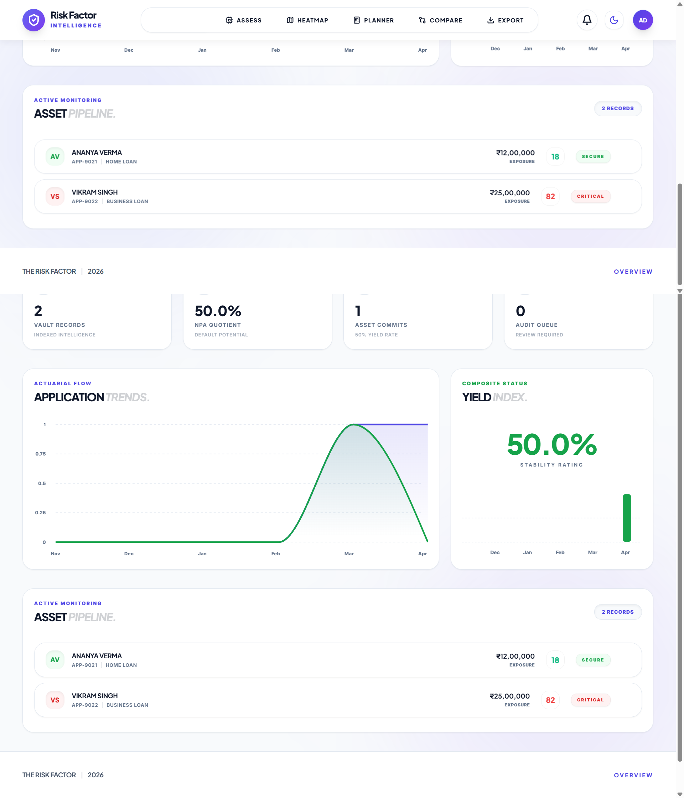
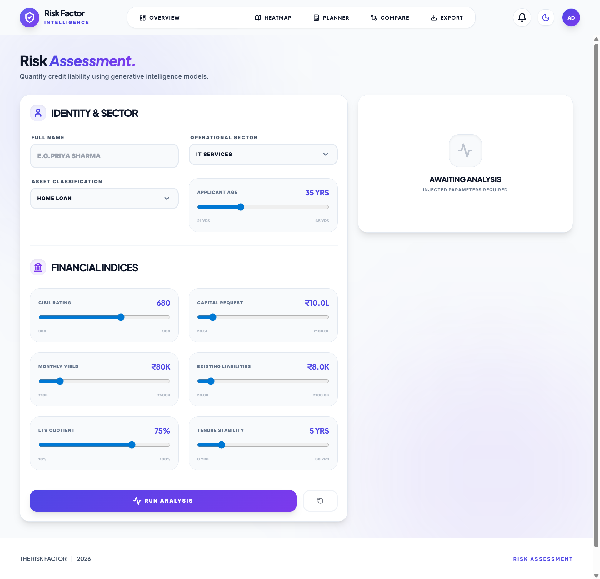
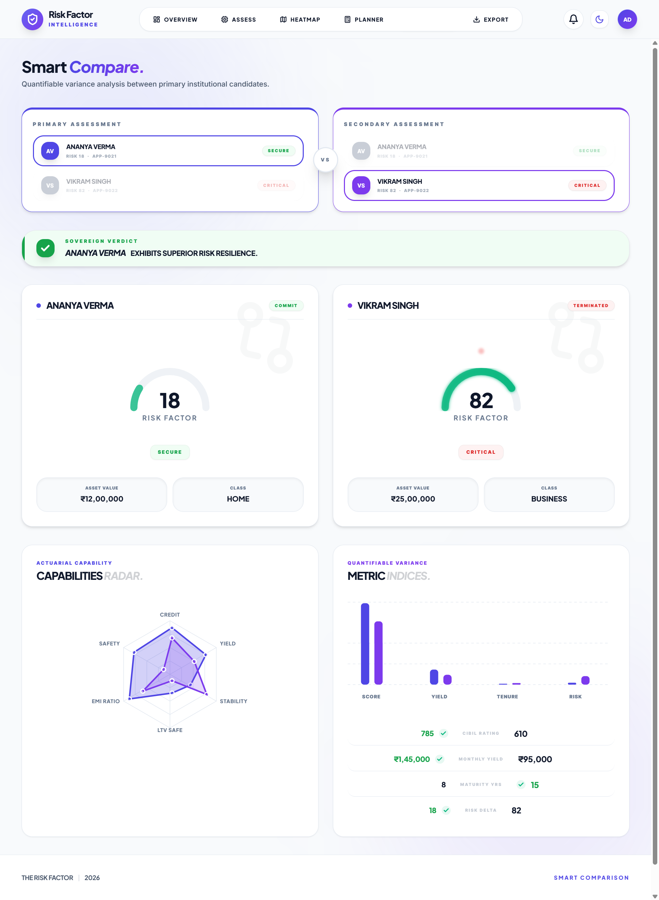
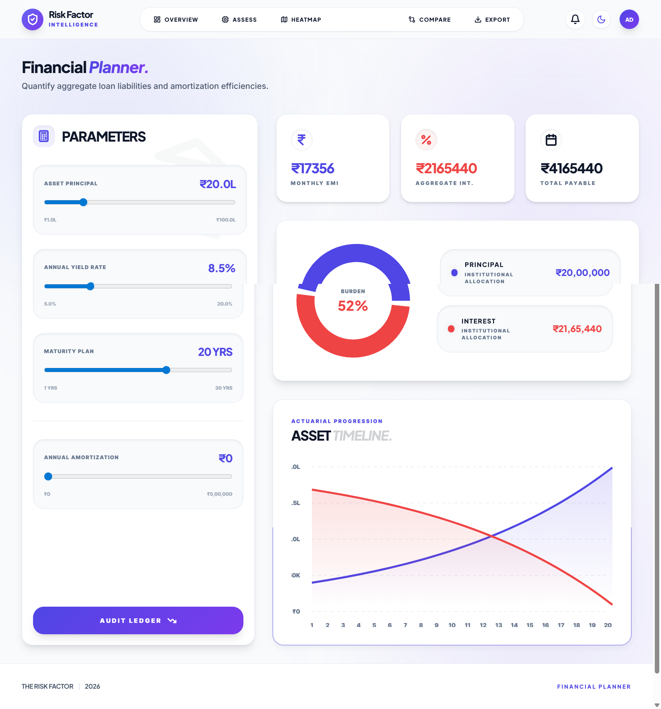

<div align="center">

# The Risk Factor
### AI-Powered Loan Risk Intelligence Platform

[](https://react.dev)
[](https://vitejs.dev)
[](https://tailwindcss.com)
[](https://www.framer.com/motion)
[](LICENSE)

> A full-stack loan risk evaluation and NPA prediction dashboard for banking analysts — featuring a custom ML-style risk scoring engine, real-time portfolio analytics, audit trail, and a dual-theme glassmorphism UI.

**[Live Demo](https://the-risk-factor.vercel.app)** &nbsp;·&nbsp; [Screenshots](#screenshots) &nbsp;·&nbsp; [Features](#features) &nbsp;·&nbsp; [Tech Stack](#tech-stack)

> 🔗 Deploy your own: see [Getting Started](#getting-started)

</div>

---

## What it does

The Risk Factor lets banking analysts **evaluate loan applicants** using a custom multi-factor risk model, **visualise portfolio health** across sectors and loan types, **compare applicants** side-by-side with radar charts, and **export** full audit trails as CSV.

---

## Features

| Module | Description |
|--------|-------------|
| **Dashboard** | Real-time portfolio metrics — NPA rate, avg risk score, total exposure, approval stats, trend charts |
| **Risk Assessment** | Submit an applicant; proprietary risk engine scores and bands them in <2s with explainability bars |
| **Sector Heatmap** | Visual risk concentration matrix across 8 sectors × 4 loan types |
| **EMI Planner** | Monthly EMI, total interest payable, amortisation schedule with prepayment simulation |
| **Smart Compare** | Side-by-side radar + metric chart comparison between any two applicants |
| **Audit Export** | Download applicant data and full audit logs as CSV; activity feed with filter |
| **Auth System** | Signup / Login with SHA-256 hashing, field validation, session persistence, dark/light mode |

---

## Tech Stack

**Frontend**
- React 18 + Vite 5
- TailwindCSS 3 (custom design system with CSS variables, glassmorphism)
- Framer Motion 11 (page transitions, micro-interactions)
- Recharts (RadarChart, BarChart, AreaChart, ScatterChart, PieChart)
- Lucide React (icons)
- React Router v7

**Backend (development)**
- json-server — full REST API on `localhost:3001`
- Custom `riskEngine.js` — logistic-regression-style scoring model
- Web Crypto API — SHA-256 password hashing (client-side)

**Testing**
- Cypress E2E — auth flows, assessment loop, navigation, API endpoint validation

---

## Getting Started

### Prerequisites
- Node.js 18+
- npm 9+

### Installation

```bash
git clone https://github.com/Imohammedareeb/the-risk-factor.git
cd the-risk-factor
npm install
```

### Running

```bash
# Recommended: run both simultaneously
npm run dev:all

# Or separately:
# Terminal 1 — JSON API (port 3001)
npm run server

# Terminal 2 — Vite dev server (port 5173)
npm run dev
```

Then open: **[http://localhost:5173](http://localhost:5173)**

### Demo Login

| Email | Password | Role |
|-------|----------|------|
| admin@riskguard.com | password123 | Analyst |

> Or create a new account via the Sign Up page.

---

## Project Structure

```
the-risk-factor/
├── src/
│   ├── components/
│   │   ├── layout/        # Navbar, MobileNav, PageShell
│   │   ├── sections/      # Dashboard, EvaluatePage, ComparePage,
│   │   │                  # HeatmapPage, EMIPage, ExportPage,
│   │   │                  # LoginPage, SignupPage, ProfilePage, NotFoundPage
│   │   └── ui/            # BentoCard, RiskGauge, RiskBadge, FactorBar,
│   │                      # AnimatedCounter, ThemeToggle, Toast
│   ├── context/
│   │   ├── AuthContext.jsx      # Auth logic, validation, SHA-256 hashing
│   │   ├── ThemeContext.jsx     # Dark / light mode with system preference
│   │   └── ToastContext.jsx     # Notification system
│   └── data/
│       ├── riskEngine.js        # Scoring algorithm (sigmoid model)
│       ├── dataService.js       # All API calls with error handling
│       └── mockData.js          # Seed data reference (dev only)
├── cypress/
│   └── e2e/core-flow.cy.js     # Full E2E test suite
├── db.json                      # json-server database (2 seed applicants)
├── tailwind.config.js
├── vite.config.js
└── index.html
```

---

## Risk Scoring Engine

`src/data/riskEngine.js` implements a **logistic-regression-style model** that computes a 0–100 NPA risk score:

```
z = intercept
  + w₁ × (creditScore − 650)     [weight: −0.0082, higher = safer]
  + w₂ × (income / loanAmount)   [weight: −1.80,   higher = safer]
  + w₃ × ltvRatio                [weight: +2.20,   higher = riskier]
  + w₄ × employmentYears         [weight: −0.11,   more = safer]
  + w₅ × (existingEMI / income)  [weight: +3.50,   higher = riskier]
  + w₆ × sectorMultiplier        [weight: +1.00,   varies by sector]

score = sigmoid(z) × 100
```

**Risk Bands:** `Low` (0–29) · `Medium` (30–59) · `High` (60–100)  
**Recommendations:** `Approve` · `Review` · `Caution` · `Reject`

---

## Screenshots

| Dashboard | Risk Assessment |
|-----------|----------------|
|  |  |

| Compare | EMI Planner |
|---------|-------------|
|  |  |

> **To update screenshots:** Run `npm run dev:all`, visit each page, take a screenshot, and save it to `public/screenshots/` with the filename shown above.

---

## API Reference (json-server)

All endpoints served from `http://localhost:3001`:

| Method | Endpoint | Description |
|--------|----------|-------------|
| `GET` | `/users?email=` | Lookup user by email |
| `POST` | `/users` | Create new user |
| `GET` | `/applicants` | All applicants |
| `GET` | `/applicants/:id` | Single applicant |
| `POST` | `/applicants` | Submit new applicant |
| `PUT` | `/applicants/:id` | Update applicant status |
| `GET` | `/auditLogs` | Full audit trail |
| `POST` | `/auditLogs` | Add audit entry |

---

## Known Limitations

- **json-server is for development only.** No rate limiting, no HTTPS, no auth middleware.
- **SHA-256 hashing is client-side.** In production: use bcrypt/Argon2 server-side with HTTPS.
- **No JWT.** Session stored in localStorage. Replace with server-issued tokens for production.
- **No pagination.** Dashboard loads all applicants — fine at demo data scale.

---

## License

MIT — free to use as a reference or portfolio project.

---

<div align="center">
Built by <strong><a href="https://github.com/Imohammedareeb">Mohammed Areeb</a></strong> &nbsp;·&nbsp; Computer Engineering, SPPU · 2026

<br/>

<sub>⭐ Star this repo if you find it useful!</sub>
</div>
